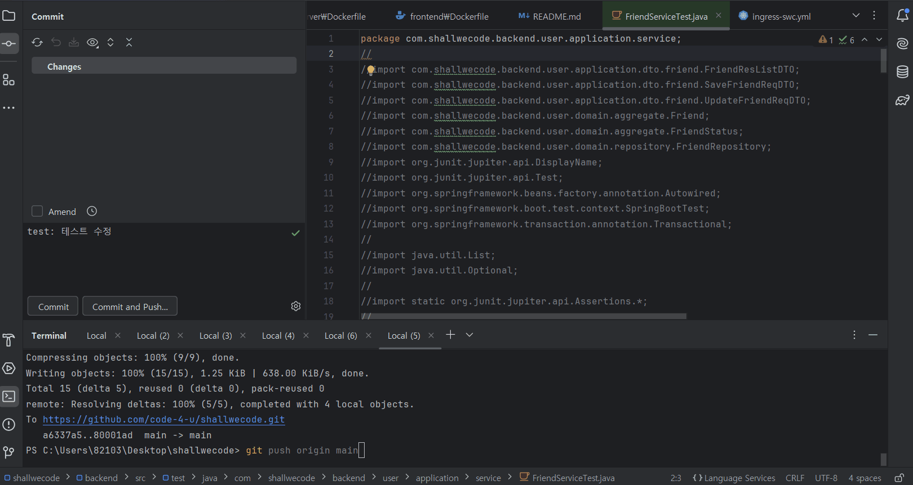

# 🕺shallwecode💃

## 4조 code-4-u~❤️
|  |  |  |  |  |
|----------------------------------------------------------------------------------------------------------------------|---------------------------------------------------------------------------------------------------------------------|-------------------------------------------------------------------------------------------------------------------|---------------------------------------------------------------------------------------------------------------------|---------------------------------------------------------------------------------------------------------------------|
| &emsp;👑박설빈                                                                                                          | &emsp;&emsp;신민철                                                                                                           | &emsp;&emsp;안세령                                                                                                         | &emsp;&emsp;이창윤                                                                                                           | &emsp;&emsp;황희순                                                                                                           |

---

## 1. 프로젝트 개요


|  |  |
|---------------------------------------------------------------------------------------------------------------------|---------------------------------------------------------------------------------------------------------------------|
| 백준 문제풀이 화면                                                                                                          | 프로그래머스 문제풀이 화면                                                                                                      |


#### 📢코딩 테스트 혼자서 하지 말고 같이 해보세요!
`shallwecode`는 함께 문제를 보면서 해결책을 찾을 수 있도록 협업하는 기능을 가진 서비스입니다. <br>
어려운 문제도 다 같이 힘을 합쳐서 헤처나가 코드에 대한 해석, 풀이 등을 공유할 수 있습니다. <br>
문제를 풀 때 화면을 함께 보면서 채팅을 통한 풀이에 대한 소통을 펼칠 수 있습니다.<br>
또한 문제를 여러번 시도한 기록으로 어떤 유형의 문제가 취약한지 파악할 수 있습니다.

## 2. 서비스 소개

📌 다른 사람들과 함께 코팅테스트 문제 해결 - 코딩방<br>
📌 함께 풀고 싶다면 망설이지 말고 바로 친구 추가 - 친구추가<br>
📌 함께 푸는 동안 채팅으로 실시간 소통 - 채팅<br>
📌 간편하게 소셜 계정으로 로그인 - 회원가입

---

## 3. 프로젝트 설계
### 3-1. 사용 기술
### Backend
<div> 
  
  
  


</div>

### Frontend

<div>
  

</div>

### DataBase

<div>
   
  
</div>

### DevOps

<div>
  
  
  
</div>


### 3-2. 요구사항 명세서
[요구사항 명세서](https://docs.google.com/spreadsheets/d/1bRwfT5mg1KW_7RQop6wORBJzDpd7K0l4RdZxASc_S_c/edit?gid=0#gid=0)

### 3-3. DDD


### 3-4. API 명세서
[REST API 명세서](https://docs.google.com/spreadsheets/d/1bRwfT5mg1KW_7RQop6wORBJzDpd7K0l4RdZxASc_S_c/edit?gid=1114348114#gid=1114348114)

### 3-5. 데이터 베이스 설계
<div>
<details>
  <summary>논리모델링</summary>

  
</details>
</div>
<div>
<details>
  <summary>물리모델링</summary>

  
</details>
</div>

### 3-6. 화면 설계서


### 3-7. 프로젝트 아키텍쳐 구조도


### 3-8. 빌드 및 배포 

#### &emsp;3-8-1. Docker File
<details>
  <summary>backend Dockerfile</summary>

  ```dockerfile
FROM openjdk:17-alpine
WORKDIR /app
COPY build/libs/*.jar ./
COPY .env .env
RUN mv $(ls *.jar | grep -v plain) app.jar
ENTRYPOINT ["java", "-jar", "app.jar"]
```
</details>

<details>
  <summary>frontend Dockerfile</summary>

  ```dockerfile
FROM nginx:stable-alpine
COPY dist /usr/share/nginx/html
COPY nginx.conf /etc/nginx/conf.d/default.conf
EXPOSE 80
CMD ["nginx", "-g", "daemon off;"]
```
</details>

<details>
  <summary>websocket Dockerfile</summary>

  ```dockerfile
FROM node:lts-alpine
WORKDIR /app
COPY . .
RUN npm install
CMD ["node", "index.js"]
```
</details>

#### &emsp;3-8-2. Kubernetes manifest
<details>
  <summary>ingress-swc</summary>

  ```yml
apiVersion: networking.k8s.io/v1
kind: Ingress
metadata:
  name: ingress-swc
  annotations:
    nginx.ingress.kubernetes.io/ssl-redirect: "false"
    nginx.ingress.kubernetes.io/rewrite-target: /$2
spec:
  ingressClassName: nginx
  rules:
    - http:
        paths:
          - path: /()(.*)
            pathType: ImplementationSpecific
            backend:
              service:
                name: vue-swc-ser
                port:
                  number: 8000
          - path: /boot(/|$)(.*)
            pathType: ImplementationSpecific
            backend:
              service:
                name: boot-swc-ser
                port:
                  number: 8001
          - path: /ws(/|$)(.*)
            pathType: ImplementationSpecific
            backend:
              service:
                name: websocket-swc-ser
                port:
                  number: 8002
```
</details>

<details>
  <summary>boot-swc-ser</summary>

  ```yml
apiVersion: v1
kind: Service
metadata:
  name: boot-swc-ser
spec:
  type: ClusterIP
  ports:
    - port: 8001
      targetPort: 8080
  selector:
    app: boot-swc-kube
```
</details>

<details>
  <summary>boot-swc-dep</summary>

  ```yml
apiVersion: apps/v1
kind: Deployment
metadata:
  name: boot-swc-dep
spec:
  selector:
    matchLabels:
      app: boot-swc-kube
  replicas: 1
  template:
    metadata:
      labels:
        app: boot-swc-kube
    spec:
      containers:
        - name: boot-container
          image: seolbin/swc_boot_project:latest
          imagePullPolicy: Always
          ports:
            - containerPort: 8080
```
</details>

<details>
  <summary>vue-swc-ser</summary>

  ```yml
apiVersion: v1
kind: Service
metadata:
  name: vue-swc-ser
spec:
  type: ClusterIP
  ports:
    - port: 8000
      targetPort: 80
  selector:
    app: vue-swc-kube
```
</details>

<details>
  <summary>vue-swc-dep</summary>

  ```yml
apiVersion: apps/v1
kind: Deployment
metadata:
  name: vue-swc-dep
spec:
  selector:
    matchLabels:
      app: vue-swc-kube
  template:
    metadata:
      labels:
        app: vue-swc-kube
    spec:
      containers:
        - name: vue-container
          image: seolbin/swc_vue_project:latest
          imagePullPolicy: Always
          ports:
            - containerPort: 80
```
</details>

<details>
  <summary>websocket-swc-ser</summary>

  ```yml
apiVersion: v1
kind: Service
metadata:
  name: websocket-swc-ser
spec:
  type: ClusterIP
  ports:
    - port: 8002
      targetPort: 1234
  selector:
    app: websocket-swc-kube
```
</details>

<details>
  <summary>websocket-swc-dep</summary>

  ```yml
apiVersion: apps/v1
kind: Deployment
metadata:
  name: websocket-swc-dep
spec:
  selector:
    matchLabels:
      app: websocket-swc-kube
  replicas: 1
  template:
    metadata:
      labels:
        app: websocket-swc-kube
    spec:
      containers:
        - name: websocket-container
          image: seolbin/swc_websocket_project:latest
          imagePullPolicy: Always
          ports:
            - containerPort: 1234
```
</details>

#### &emsp;3-8-3. Jenkins Pipeline Script
<details>
  <summary>Jenkins Pipeline Script</summary>

  ```pipeline script
pipeline {
    agent any

    tools {
        gradle 'gradle'
        jdk 'openJDK17'
    }

    environment {
        SOURCE_GITHUB_URL = 'https://github.com/code-4-u/shallwecode/'
        MANIFESTS_GITHUB_URL = 'https://github.com/seolbin01/k8s-manifests'
        GIT_USERNAME = 'seolbin01'
        GIT_EMAIL = 'seolbinpark01@gmail.com'
        DOCKERHUB_CREDENTIALS = credentials('DOCKERHUB_PASSWORD')
        GITHUB_URL = 'https://github.com/code-4-u/shallwecode'
        FRONTEND_IMAGE = 'swc_vue_project'
        BACKEND_IMAGE = 'swc_boot_project'
        WEBSOCKET_IMAGE = 'swc_websocket_project'
    }

    stages {
        stage('Source Build') {
            steps {
                git branch: 'main', url: "${env.SOURCE_GITHUB_URL}"
                script {
                    dir('backend') { 
                        configFileProvider([configFile(fileId: 'shallwecodeenv', targetLocation: '.env')]) {
                            if (isUnix()) {
                                sh "chmod +x ./gradlew"
                                sh "./gradlew clean build"
                            } else {
                                bat "gradlew.bat clean build"
                            }
                        }
                    }
                    dir('frontend') {
                        if (isUnix()) {
                            sh 'rm -rf dist'
                            sh 'npm install'
                            sh 'npm run build'
                        } else {
                            bat 'if exist dist rd /s /q dist'
                            bat 'npm install'
                            bat 'npm run build'
                        }
                    }
                    dir('websocket-server') {
                        if (isUnix()) {
                            sh 'npm install'
                        } else {
                            bat 'npm install'
                        }
                    }
                }
            }
        }

        stage('Run Tests') {
            steps {
                script {
                    dir('backend') { 
                        configFileProvider([configFile(fileId: 'shallwecodeenv', targetLocation: '.env')]) {
                            if (isUnix()) {
                                sh "./gradlew test"
                            } else {
                                bat "gradlew.bat test"
                            }
                        }
                    }
                }
            }
            post {
                always {
                    junit '**/build/test-results/test/*.xml'
                }
            }
        }

        stage('Docker Build and Push') {
            steps {
                script {
                    withCredentials([usernamePassword(credentialsId: 'DOCKERHUB_PASSWORD', 
                                                    usernameVariable: 'DOCKER_USER', 
                                                    passwordVariable: 'DOCKER_PASS')]) {
                        dir('backend') {
                            if (isUnix()) {
                                sh "docker build -t ${DOCKER_USER}/${BACKEND_IMAGE}:latest ."
                                sh "docker login -u ${DOCKER_USER} -p ${DOCKER_PASS}"
                                sh "docker push ${DOCKER_USER}/${BACKEND_IMAGE}:latest"
                            } else {
                                bat "docker build -t ${DOCKER_USER}/${BACKEND_IMAGE}:latest ."
                                bat "docker login -u %DOCKER_USER% -p %DOCKER_PASS%"
                                bat "docker push ${DOCKER_USER}/${BACKEND_IMAGE}:latest"
                            }
                        }
                        dir('frontend') {
                            if (isUnix()) {
                                sh "docker build -t ${DOCKER_USER}/${FRONTEND_IMAGE}:latest ."
                                sh "docker push ${DOCKER_USER}/${FRONTEND_IMAGE}:latest"
                            } else {
                                bat "docker build -t ${DOCKER_USER}/${FRONTEND_IMAGE}:latest ."
                                bat "docker push ${DOCKER_USER}/${FRONTEND_IMAGE}:latest"
                            }
                        }
                        dir('websocket-server') {
                            if (isUnix()) {
                                sh "docker build -t ${DOCKER_USER}/${WEBSOCKET_IMAGE}:latest ."
                                sh "docker push ${DOCKER_USER}/${WEBSOCKET_IMAGE}:latest"
                            } else {
                                bat "docker build -t ${DOCKER_USER}/${WEBSOCKET_IMAGE}:latest ."
                                bat "docker push ${DOCKER_USER}/${WEBSOCKET_IMAGE}:latest"
                            }
                        }
                    }
                }
            }
        }
    }

    post {
        always {
            script {
                if (isUnix()) {
                    sh 'docker logout'
                } else {
                    bat 'docker logout'
                }
            }
        }
        success {
            withCredentials([string(credentialsId: 'discord', variable: 'DISCORD')]) {
                discordSend(
                    description: """
                    **빌드 성공!** :tada:
                    
                    **제목**: ${currentBuild.displayName}
                    **결과**: :white_check_mark: ${currentBuild.currentResult}
                    **실행 시간**: ${currentBuild.duration / 1000}s
                    **링크**: [빌드 결과 보기](${env.BUILD_URL})
                    """,
                    title: "${env.JOB_NAME} 빌드 성공!", 
                    webhookURL: "$DISCORD"
                )
            }
        }
        failure {
            withCredentials([string(credentialsId: 'discord', variable: 'DISCORD')]) {
                discordSend(
                    description: """
                    **빌드 실패!** :x:
                    
                    **제목**: ${currentBuild.displayName}
                    **결과**: :x: ${currentBuild.currentResult}
                    **실행 시간**: ${currentBuild.duration / 1000}s
                    **링크**: [빌드 결과 보기](${env.BUILD_URL})
                    """,
                    title: "${env.JOB_NAME} 빌드 실패!", 
                    webhookURL: "$DISCORD"
                )
            }
        }
    }
}
```
</details>


#### &emsp;3-9. Jenkins CI/CD 테스트 결과 화면
<details>
    <summary>Jenkins CI/CD 테스트 결과 화면 (gif)</summary>
    

</details>

---

## 4. 프로젝트 기능 테스트 결과서

### 4-1. 회원 기능 

### 4-2. 친구 기능

### 4-3. 알림 기능

### 4-4. 관리자 기능

### 4-5. 문제 기능

### 4-6. 채팅 기능

---

## 🍀팀 회고

| 팀원  | 회고 내용                                                                                                                                                                                                                                                                                                |
|:---:|------------------------------------------------------------------------------------------------------------------------------------------------------------------------------------------------------------------------------------------------------------------------------------------------------|
| 박설빈 | 데브옵스 관련 스킬을 배우며 전체 흐름을 파악할 수 있었고 관련 기술의 숙련도를 높일 수 있어 좋았습니다. 하지만 서버를 로컬로만 실행하게 되어 개인 노트북에서만 돌아가도록 설정된 점이 아쉬웠습니다. 다음에는 클라우드 서버와 연동하여 배포까지 자동화하는 세팅을 해보고 싶습니다. 그리고 다음 프로젝트에서는 초기 단계부터 데브옵스 환경을 세팅하여 자동화된 상태에서 프로젝트를 진행하고 싶습니다. 데브옵스 관련 숙련도가 충분하지 않아 발생한 오류를 찾고 해결하는 데 어려웠지만 다음 최종 프로젝트에서는 더 발전하고 싶습니다. |
| 이창윤 |                                                                                                                                                                                                                                                                                                      |
| 안세령 | 이번 프로젝트에서는 한화 SW 부트캠프에서 배웠던 내용을 전체적으로 훑을 수 있는 시간이였던 것 같습니다. 기본 기능 구현에만 참여하면서 개인적으로 아쉬움이 많이 남습니다. 최종 프로젝트에는 다양한 기능을 활용하여 개발에 능동적으로 참여하고 싶습니다.                                                                                                                                                         |
| 신민철 | 이번 데브옵스 프로젝트를 진행하면서 수업시간에 배운 도커 및 쿠버네티스를 사용해보고 싶었지만 맡은 프론트와 백 CRUD도 벅차 생각에만 그쳐 아쉽습니다. 나아진 점은 이제 스프링의 CQRS 구조에 대해 잘 알게 되었고 JPA도 많이 익숙해졌다는 것입니다. 웹소켓이나 소셜 로그인 파트도 도전해보고 싶었지만, 1~2주라는 한정된 시간 내에서 제가 맡을 능력이 되지 않는다는 사실이 슬펐습니다. 최종 프로젝트때에는 AWS를 사용해서 배포까지 진행하게 될텐데 위 부분들을 프로젝트에 적용해 볼 수 있는 기회가 되었으면 좋겠습니다. |
| 황희순 | 이번 프로젝트를 하면서 WebSocket을 확실하게 다룰 수 있게 되었습니다. 시간이 없었던 터라 이미 만들어 놓은 웹 소켓을 다시 사용하는 과정에서 웹 소켓을 더 정확하게 알게 된거 같습니다. 최종 프로젝트 때는 STOMP 사용도 해보며 더 고도화 시키는 데에 신경을 써야 할 것 같습니다. 한가지 아쉬운 것은 시큐리티나 도커 등 다른 기술들도 사용하지 못한 것이 조금 아쉬운 점으로 남았다 이부분은 최종 프로젝트 하면서 겪게 될 거 같습니다.                                            |
